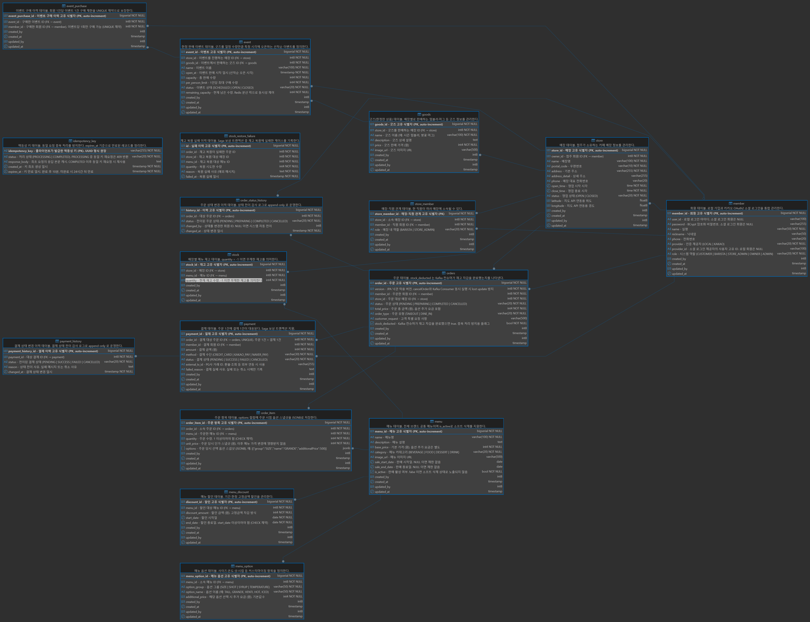

# WhaleOrder 🐋

> 스타벅스 사이렌 오더를 모티브로 한 **고성능 음료 주문 시스템**  
> 수천 명의 동시 주문을 안정적으로 처리하는 백엔드 아키텍처에 집중했습니다.

---

## 핵심 구현 포인트

### 1. 동시성 제어 — Redisson 분산 락

수천 명이 동시에 같은 메뉴를 주문할 때 재고가 음수로 떨어지는 문제를 해결했습니다.

```
문제: 스레드 A, B가 동시에 재고=1 조회 → 둘 다 차감 → 재고 -1
해결: Redis 분산 락으로 매장+메뉴 단위 직렬화
```

- 락 키: `stock:lock:{storeId}:{menuId}` — 같은 매장의 다른 메뉴 주문은 블로킹하지 않음
- 대기 최대 5초 / 점유 최대 3초로 데드락 방지
- `isHeldByCurrentThread()` 체크로 타임아웃 후 unlock 예외 방지

**검증**: 30개 스레드 동시 차감 테스트 → 재고 정확히 0, 초과 주문 0건

---

### 2. 실시간 상태 전송 — SSE (Server-Sent Events)

주문 접수 → 제조 중 → 완료 상태를 클라이언트에 실시간 푸시합니다.

```
고객 브라우저 ──subscribe──▶ /api/orders/{id}/updates (SSE)
어드민 상태 변경 ──────────▶ notifyStatusUpdate() ──▶ 고객 브라우저
```

- **Race condition 처리**: 워커가 처리 완료했는데 브라우저가 아직 연결 전인 경우 → `pendingResults`에 보관 후 연결 시 즉시 전송
- **어드민 브로드캐스트**: 새 주문 발생 시 연결된 모든 어드민 브라우저에 동시 전송
- **Heartbeat**: 25초 주기로 ping 전송 → 프록시 유휴 연결 끊김 방지

---

### 3. 장애 내성 — Saga 패턴 보상 트랜잭션

외부 결제 API 실패 시 데이터 정합성을 유지합니다.

```
결제 성공(90%) → 주문 생성 → Kafka 큐 등록
결제 실패(10%) → 주문 CANCELLED → 재고 복구 → PaymentFailedException
재고 복구 실패  → StockRestoreFailure DB 기록 → 어드민 SSE 알림
```

- 재고 복구 실패는 유실 없이 DB에 기록되고 어드민에 실시간 경고
- 재고 복구 실패 시 200ms 간격 3회 재시도 → 일시적 Redis 락 경합으로 인한 불필요한 불일치 방지
- `PaymentHistory`로 모든 결제 시도 이력 추적

---

### 4. 대용량 주문 처리 — Kafka

동시 주문 폭증 시 서버 과부하를 방지합니다.

```
주문 요청 → Kafka Topic(order-created) → Consumer 순차 처리
```

- 처리 실패 시 DLT(Dead Letter Topic)로 이동 → 유실 없는 재처리
- 멱등성 키(`IdempotencyService`)로 중복 주문 방지
- DB 커밋 이후 Kafka 발행 (`@TransactionalEventListener AFTER_COMMIT`) → 커밋 실패 시 메시지 유실 없음, 장바구니 보존 보장

---

## 시스템 아키텍처

```
┌─────────────────────────────────────────────────────────┐
│                      Client                             │
│          React (Vite) + SSE 실시간 구독                  │
└──────────────────────┬──────────────────────────────────┘
                       │ HTTP / SSE
┌──────────────────────▼──────────────────────────────────┐
│              Spring Boot 3.x (Java 21)                  │
│  ┌──────────┐  ┌──────────┐  ┌──────────┐  ┌────────┐  │
│  │  Order   │  │ Payment  │  │  Stock   │  │ Event  │  │
│  │ Service  │  │ Service  │  │  Lock    │  │ Queue  │  │
│  └────┬─────┘  └────┬─────┘  └────┬─────┘  └───┬────┘  │
└───────┼─────────────┼─────────────┼─────────────┼───────┘
        │             │             │             │
   ┌────▼────┐   ┌────▼────┐  ┌────▼────┐   ┌───▼────┐
   │  Kafka  │   │Postgres │  │  Redis  │   │  SSE   │
   │  Queue  │   │  (주문) │  │(분산 락)│   │Emitter │
   └─────────┘   └─────────┘  └─────────┘   └────────┘
        │
┌───────▼──────────────────────────────────────────────────┐
│              Prometheus + Grafana                         │
│      TPS · p95 레이턴시 · JVM · DB 커넥션 풀 실시간 시각화 │
└──────────────────────────────────────────────────────────┘
```

---

## DB 엔티티 ERD



> **주요 테이블**
> - `members` — 회원 (LOCAL / KAKAO OAuth2)
> - `stores` / `store_members` — 매장 및 매장 소속 직원
> - `menus` / `menu_options` / `menu_discounts` — 메뉴 및 옵션·할인
> - `orders` / `order_items` / `order_status_history` — 주문 및 상태 이력
> - `payments` / `payment_history` — 결제 및 결제 시도 이력
> - `stocks` / `stock_restore_failures` — 재고 및 복구 실패 기록
> - `idempotency_records` — 중복 주문 방지 멱등성 키
> - `events` / `goods` / `event_purchases` — 한정판매 이벤트

---

## 기술 스택

| 분류 | 기술 |
|------|------|
| Language | Java 21 (Virtual Threads) |
| Framework | Spring Boot 3.5, Spring Security, Spring Data JPA |
| Database | PostgreSQL 16, Querydsl (동적 쿼리) |
| Cache / Lock | Redis 7, Redisson 3.27 (분산 락) |
| Messaging | Apache Kafka (KRaft 모드) |
| 인증 | JWT, OAuth2 (카카오 로그인) |
| 실시간 | SSE (Server-Sent Events) |
| Monitoring | Prometheus, Grafana |
| Test | JUnit 5, Testcontainers (PostgreSQL · Redis), k6 부하 테스트 |
| 인프라 | Docker, GitHub Actions CI/CD, AWS EC2 |
| Frontend | React 18 (Vite) |

---

## 부하 테스트 결과

k6로 점진적 부하 (1명 → 50명 동시 접속, 2분간) 측정

| 지표 | 결과 | 목표 | 통과 |
|------|------|------|------|
| p95 응답시간 (전체) | 333 ms | < 2,000 ms | ✅ |
| p95 응답시간 (주문 생성) | 151 ms | - | - |
| HTTP 에러율 | 4.90% | < 5% | ✅ |
| 주문 성공률 | 75.6% (910 / 1,203건) | > 90% | ❌ |

**비고**: 주문 성공률 미달(24.35% 실패)은 테스트 도중 재고 소진으로 인한 정상적인 재고 부족 응답이 포함된 결과입니다. 응답 속도·에러율 임계값은 모두 통과했습니다.

| 상세 지표 | 값 |
|-----------|-----|
| 총 요청 수 | 6,017건 (45.7 req/s) |
| 총 반복 수 | 1,205 iterations |
| 평균 응답시간 | 92.1 ms |
| 최대 응답시간 | 1.56 s |
| 주문 성공 | 910건 |
| 주문 실패 | 293건 |

> 실행 방법:
> ```bash
> docker run --rm -i \
>   -e K6_PROMETHEUS_RW_SERVER_URL=http://host.docker.internal:9090/api/v1/write \
>   grafana/k6 run --out experimental-prometheus-rw - < k6/order-load-test.js
> ```

---

## 로컬 실행 방법

### 사전 준비
- Docker Desktop
- Java 21

### 전체 스택 실행

```bash
# 인프라 (PostgreSQL, Redis, Kafka, Prometheus, Grafana)
docker-compose -f docker-compose.prod.yml up -d

# 백엔드
./gradlew bootRun

# 프론트엔드
cd frontend && npm install && npm run dev
```

### 접속 주소

| 서비스 | 주소 |
|--------|------|
| 프론트엔드 | http://localhost:5173 |
| 백엔드 API | http://localhost:8080 |
| Swagger UI | http://localhost:8080/swagger-ui.html |
| Grafana | http://localhost:3001 (admin / admin1234) |
| Kafka UI | http://localhost:8989 |
| Prometheus | http://localhost:9090 |

---

## 환경 변수

프로젝트 루트에 `.env` 파일 생성:

```env
DB_HOST=localhost
DB_PORT=5432
DB_NAME=whaleorder
DB_USERNAME=whale
DB_PASSWORD=whale
REDIS_HOST=localhost
REDIS_PORT=6379
JWT_SECRET=your-secret-key-here
```

---

## CI/CD

`main` 브랜치 푸시 시 자동 배포:

```
git push → GitHub Actions
  → 백엔드 Docker 이미지 빌드 & Docker Hub 푸시
  → 프론트엔드 Docker 이미지 빌드 & Docker Hub 푸시
  → EC2 SSH 접속 → docker-compose pull & up
```

**필요한 GitHub Secrets**

| 키 | 설명 |
|----|------|
| `DOCKER_USERNAME` | Docker Hub 아이디 |
| `DOCKER_PASSWORD` | Docker Hub 비밀번호 |
| `EC2_HOST` | EC2 퍼블릭 IP |
| `EC2_SSH_KEY` | EC2 PEM 키 (전체 내용) |
| `JWT_SECRET` | JWT 서명 키 |

---

## 프로젝트 구조

```
WhaleOrder/
├── src/main/java/com/whale/order/
│   ├── domain/
│   │   ├── order/          # 주문 (Kafka 큐 + SSE)
│   │   ├── payment/        # 결제 (Saga 패턴)
│   │   ├── stock/          # 재고 (Redisson 분산 락)
│   │   ├── cart/           # 장바구니 (Redis)
│   │   ├── event/          # 이벤트 선착순 구매
│   │   ├── menu/           # 메뉴 관리
│   │   ├── store/          # 매장 관리
│   │   └── member/         # 회원 (JWT + OAuth2)
│   └── global/
│       ├── auth/           # 인증/인가
│       ├── config/         # 설정 (Redis, Kafka, Redisson)
│       └── idempotency/    # 멱등성 처리
├── frontend/               # React 18 (Vite)
├── k6/                     # 부하 테스트 스크립트
├── monitoring/             # Prometheus + Grafana 설정
└── docker-compose.prod.yml
```
