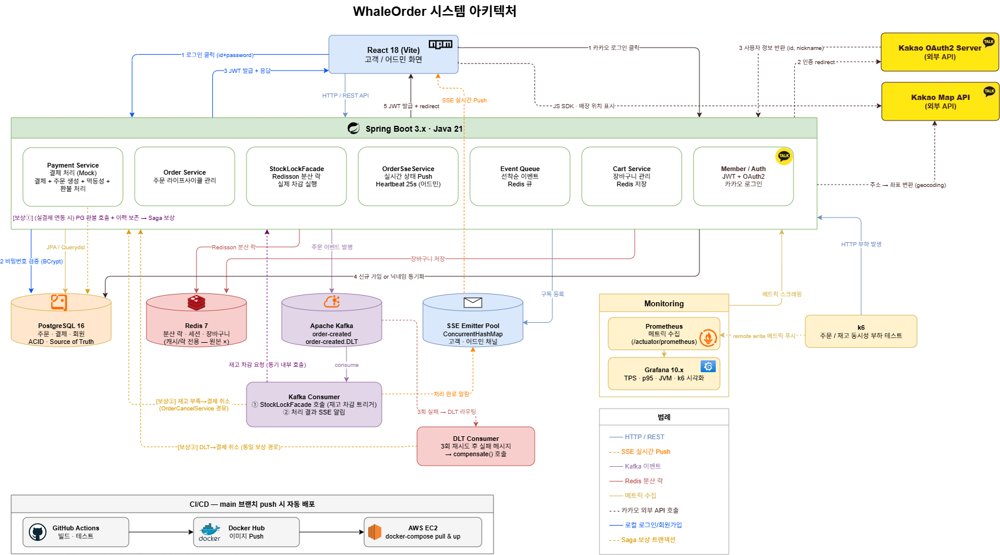
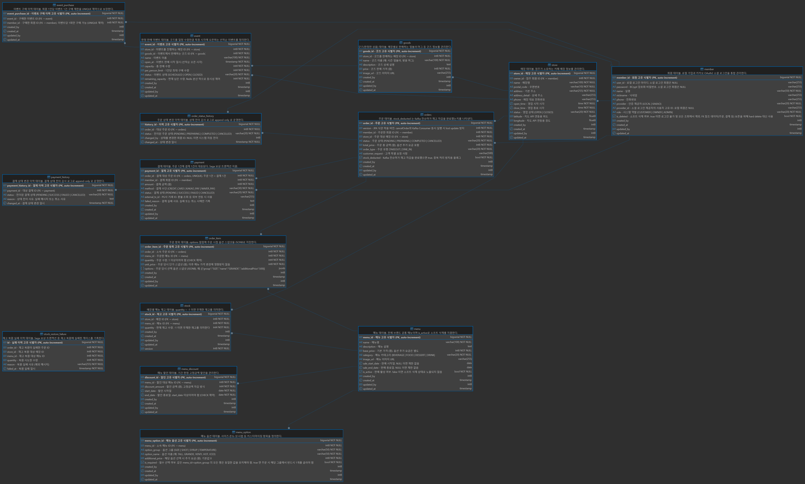

# WhaleOrder 🐋

> 스타벅스 사이렌 오더를 모티브로 한 **음료 주문 시스템**  
> 수천 명의 동시 주문을 안정적으로 처리하는 백엔드 아키텍처에 집중했습니다.

---

## 핵심 구현 포인트

### 1. 동시성 제어 — 분산 락 + 트랜잭션 타임아웃 + 낙관적 락 (3중 방어)

수천 명이 동시에 같은 메뉴를 주문할 때 재고가 음수로 떨어지는 문제를 해결했습니다.

```
문제: 스레드 A, B가 동시에 재고=1 조회 → 둘 다 차감 → 재고 -1
해결: Redisson 분산 락(직렬화) + 트랜잭션 타임아웃(hang 차단) + DB 낙관적 락(lost update 차단)
```

- **1차 — 분산 락(watchdog)**: 락 키 `stock:lock:{storeId}:{menuId}`로 매장·메뉴 단위 직렬화(같은 매장 다른 메뉴는 블로킹 안 함). 대기 최대 5초, `leaseTime` 생략 → watchdog 자동 갱신으로 트랜잭션이 길어져도 만료 안 됨, 보유자 사망 시 30초 후 해제
- **2차 — `@Transactional(timeout = 10)`**: 트랜잭션 hang 시 강제 종료 → 락 보유자가 무한 hang 되지 않음
- **3차 — Stock `@Version` 낙관적 락**: Redis 장애 등으로 분산 락이 새는 극단 케이스에도 `UPDATE ... WHERE version=?`로 DB 레벨 lost update 차단. 충돌 시 `OptimisticLockException` → Saga 보상이 받음
- `isHeldByCurrentThread()` 체크로 타임아웃 후 unlock 예외 방지

**검증**: `k6/stock-concurrency-test.js` — 재고 10개에 20명 동시 결제 → 정확히 10건 차감, 오버셀 0 (아래 [재고 동시성 / 분산락 검증](#재고-동시성--분산락-검증) 참고)

---

### 2. 실시간 상태 전송 — SSE (Server-Sent Events)

주문 접수 → 제조 중 → 완료 상태를 클라이언트에 실시간 푸시합니다.

```
고객 브라우저 ──subscribe──▶ /api/orders/{id}/updates (SSE)
어드민 상태 변경 ──────────▶ notifyStatusUpdate() ──▶ 고객 브라우저
```

- **Race condition 처리**: 워커가 처리 완료했는데 브라우저가 아직 연결 전인 경우 → `pendingResults`에 보관 후 연결 시 즉시 전송
- **어드민 브로드캐스트**: 새 주문 발생 시 연결된 모든 어드민 브라우저에 동시 전송
- **Heartbeat**: 25초 주기로 ping 전송 → 프록시 유휴 연결 끊김 방지

---

### 3. 장애 내성 — Saga 패턴 보상 트랜잭션

외부 결제 API 실패 시 데이터 정합성을 유지합니다.

```
결제 성공(90%) → 주문 생성 → Kafka 큐 등록
결제 실패(10%) → 주문 CANCELLED → 재고 복구 → PaymentFailedException
재고 복구 실패  → StockRestoreFailure DB 기록 → 어드민 SSE 알림
```

- 재고 복구 실패는 유실 없이 DB에 기록되고 어드민에 실시간 경고
- 재고 복구 실패 시 200ms 간격 3회 재시도 → 일시적 Redis 락 경합으로 인한 불필요한 불일치 방지
- `PaymentHistory`로 모든 결제 시도 이력 추적

---

### 4. 대용량 주문 처리 — Kafka

동시 주문 폭증 시 서버 과부하를 방지합니다.

```
주문 요청 → Kafka Topic(order-created) → Consumer 순차 처리
```

- 처리 실패 시 DLT(Dead Letter Topic)로 이동 → 유실 없는 재처리
- 멱등성 키(`IdempotencyService`)로 중복 주문 방지
- DB 커밋 이후 Kafka 발행 (`@TransactionalEventListener AFTER_COMMIT`) → 커밋 실패 시 메시지 유실 없음, 장바구니 보존 보장

> 🗂️ **각 항목의 세부 설계·코드 위치·트레이드오프**는 [wiki](docs/wiki/Home.md) 참조

---

## 시스템 아키텍처



---

## DB 엔티티 ERD



> **주요 테이블**
> - `members` — 회원 (LOCAL / KAKAO OAuth2)
> - `stores` / `store_members` — 매장 및 매장 소속 직원
> - `menus` / `menu_options` / `menu_discounts` — 메뉴 및 옵션·할인
> - `orders` / `order_items` / `order_status_history` — 주문 및 상태 이력
> - `payments` / `payment_history` — 결제 및 결제 시도 이력
> - `stocks` / `stock_restore_failures` — 재고 및 복구 실패 기록
> - `events` / `goods` / `event_purchases` — 한정판매 이벤트

> 멱등성 키는 Redis(`idem:{sha256}`, SET NX EX) 로 관리 — DB 테이블 없음. 자세한 내용은 [Redis 활용처](docs/wiki/architecture/redis-usage.md) 참조.

---

## 기술 스택

| 분류 | 기술 |
|------|------|
| Language | Java 21 (Virtual Threads) |
| Framework | Spring Boot 3.5, Spring Security, Spring Data JPA |
| Database | PostgreSQL 16, Querydsl (동적 쿼리) |
| Cache / Lock | Redis 7, Redisson 3.27 (분산 락) |
| Messaging | Apache Kafka (KRaft 모드) |
| 인증 | JWT, OAuth2 (카카오 로그인) |
| 실시간 | SSE (Server-Sent Events) |
| Monitoring | Prometheus, Grafana |
| Test | JUnit 5, Testcontainers (PostgreSQL · Redis), k6 부하 테스트 |
| 인프라 | Docker, GitHub Actions CI/CD, AWS EC2 |
| Frontend | React 18 (Vite) |

---

## 부하 테스트 결과

k6로 점진적 부하 (1명 → 50명 동시 접속, 2분간) 측정 — 선결제(`POST /api/payments`) 기준

| 지표 | 결과 | 목표 | 통과 |
|------|------|------|------|
| p95 응답시간 (전체) `http_req_duration` | 105.44 ms | < 2,000 ms | ✅ |
| p95 응답시간 (결제) `payment_duration_ms` | 18 ms | < 2,000 ms | ✅ |
| 시스템 에러율 `payment_fail_rate` | 0.00% | < 5% | ✅ |

**비고**: 결제 성공률 99.7% (2,343 / 2,349건). 나머지 6건은 Mock PG의 의도된 10% 실패(402)로, 보상 트랜잭션이 정상 동작한 결과이며 시스템 에러가 아닙니다. 시스템 에러(5xx·검증 실패 등)는 **0건**입니다.

| 결제 응답 분포 | 건수 |
|----------------|------|
| 결제 성공 (200) | 2,343건 |
| Mock PG 실패 (402, 정상 — 보상 처리됨) | 6건 |
| 시스템 에러 (그 외) | 0건 |

| 상세 지표 | 값 |
|-----------|-----|
| 총 요청 수 | 11,745건 (97.4 req/s) |
| 총 반복 수 | 2,349 iterations (19.5/s) |
| 평균 응답시간 (전체) | 30.89 ms |
| 최대 응답시간 (전체) | 611.98 ms |
| 결제 평균 / 최대 응답시간 | 11.55 ms / 442 ms |
| HTTP 에러율 | 0.05% (6 / 11,745건 — 전부 Mock PG 402) |

> 실행 방법:
> ```bash
> docker run --rm -i \
>   -e K6_PROMETHEUS_RW_SERVER_URL=http://host.docker.internal:9090/api/v1/write \
>   grafana/k6 run --out experimental-prometheus-rw - < k6/order-load-test.js
> ```

---

## 재고 동시성 / 분산락 검증

재고 **10개** 메뉴에 **20명이 동시에 결제** → 분산락이 재고 차감을 직렬화해 **정확히 10건만 차감, 오버셀 0**을 검증합니다.

> 결제(`POST /api/payments`)는 재고와 무관하게 성공하고, 재고 차감은 그 뒤 비동기(Kafka → `OrderProcessingService`)로 일어납니다. 따라서 검증은 HTTP 응답이 아니라 **테스트 종료 후 실제 잔여 재고**로 합니다.

| 항목 | 결과 |
|------|------|
| 초기 재고 | 10개 |
| 동시 결제 | 20명 |
| 결제 성공 (200) | 18건 |
| Mock PG 실패 (402, 정상) | 2건 |
| 시스템 에러 | 0건 |
| **실제 재고 차감** | **정확히 10건** (최종 재고 0) |
| 오버셀 (재고 음수) | **0건** |
| 재고부족 보상 취소 (Saga) | 8건 (결제 성공 18건 − 차감 10건) |

**결론**: 결제는 18건 통과했지만 Redisson 분산 락이 재고 차감을 10건으로 직렬화했고, 초과한 8건은 `OrderProcessingService`가 재고 부족으로 감지해 주문 취소·재고 복구(보상 트랜잭션)했습니다. 동시 차감으로 인한 재고 음수(오버셀)는 발생하지 않았습니다.

> 실행 방법 (Kafka 컨슈머가 도는 프로파일 필요):
> ```bash
> docker run --rm -i grafana/k6 run - < k6/stock-concurrency-test.js
> ```

---

## 멱등성 / 중복 결제 방지 검증

한 사용자가 **동일한 결제 요청을 20회 동시 전송**(더블클릭·네트워크 재시도 시뮬레이션) → SHA-256 멱등성 키가 같으므로 **단 1건만 처리되고 나머지는 거절**, 중복 주문·중복 결제가 생기지 않음을 검증합니다.

> 멱등성 키 = `SHA-256(memberId, storeId, method, orderType, customerRequest, cart)`. 첫 요청이 `markProcessing`으로 키를 선점하면, 동시에 들어온 나머지 요청은 `DuplicateRequestException(409)`로 거절됩니다.

| 항목 | 결과 |
|------|------|
| 동시 전송 (동일 결제) | 20회 |
| 처리 성공 (200) | **1건** |
| 중복 거절 (409) | 19건 |
| 시스템 에러 | 0건 |
| **실제 생성된 주문 수** | **1건** (성공 1) |

**결론**: 20개 요청이 동시에 같은 멱등성 키로 진입했지만 1건만 주문·결제가 생성되고 나머지 19건은 409로 차단됐습니다. HTTP 응답 분포뿐 아니라 `GET /api/orders`로 **실제 생성된 주문이 1건**임을 교차 확인해, 더블클릭/재시도 상황에서도 중복 결제가 발생하지 않음을 검증했습니다.

> 실행 방법:
> ```bash
> docker run --rm -i grafana/k6 run - < k6/idempotency-test.js
> ```

---

## 선착순 이벤트 동시성 검증 (비관적 락)

한정 수량 **10개** 굿즈 이벤트에 **20명이 동시에 선착순 구매** → DB 비관적 락(`SELECT ... FOR UPDATE`)이 재고 차감을 직렬화해 **정확히 10건만 판매, 오버셀 0**을 검증합니다.

> 재고 동시성(Redisson 분산 락)과 **다른 경로**입니다. 이벤트 구매는 `eventRepository.findWithLock`으로 행을 잠근 뒤 재고를 차감하므로, 비관적 락의 정확성을 독립적으로 검증합니다.
>
> 흐름: 대기열 `join`(Redis Sorted Set, join 시각 순) → Scheduler가 남은 수량만큼 순번대로 구매 권한 부여 → 사용자 `purchase`.

| 항목 | 결과 |
|------|------|
| 이벤트 한정 수량 (capacity) | 10개 |
| 동시 참여 | 20명 |
| 구매 성공 (200) | **10건** |
| 구매 거절 (재고 소진 등) | 0건 |
| 권한 미부여 (순번 밀림) | 10건 |
| 에러 | 0건 |
| **최종 잔여 수량** | **0개** (오버셀 0) |

**결론**: 20명이 동시에 달려들었지만 비관적 락이 구매를 직렬화해 정확히 10 만큼만 판매됐습니다. 앞 순번 10명이 권한을 받아 구매하면서 재고가 0이 되자, 나머지 10명은 권한이 부여되지 않아(`not_ready`) 구매 시도조차 없었습니다 — 초과 판매(오버셀)는 발생하지 않았습니다.

> 실행 방법 (Scheduler가 도는 프로파일 필요):
> ```bash
> docker run --rm -i grafana/k6 run - < k6/event-purchase-test.js
> ```

---

## 로컬 실행 방법

### 사전 준비
- Docker Desktop
- Java 21

### 전체 스택 실행

```bash
# 인프라 (PostgreSQL, Redis, Kafka, Prometheus, Grafana)
docker-compose -f docker-compose.prod.yml up -d

# 백엔드
./gradlew bootRun

# 프론트엔드
cd frontend && npm install && npm run dev
```

### 접속 주소

| 서비스 | 주소 |
|--------|------|
| 프론트엔드 | http://localhost:5173 |
| 백엔드 API | http://localhost:8080 |
| Swagger UI | http://localhost:8080/swagger-ui.html |
| Grafana | http://localhost:3001 (admin / admin1234) |
| Kafka UI | http://localhost:8989 |
| Prometheus | http://localhost:9090 |

---

## 환경 변수

프로젝트 루트에 `.env` 파일 생성:

```env
DB_HOST=localhost
DB_PORT=5432
DB_NAME=whaleorder
DB_USERNAME=whale
DB_PASSWORD=whale
REDIS_HOST=localhost
REDIS_PORT=6379
JWT_SECRET=your-secret-key-here
```

---

## CI/CD

`main` 브랜치 푸시 시 자동 배포:

```
git push → GitHub Actions
  → 백엔드 Docker 이미지 빌드 & Docker Hub 푸시
  → 프론트엔드 Docker 이미지 빌드 & Docker Hub 푸시
  → EC2 SSH 접속 → docker-compose pull & up
```

**필요한 GitHub Secrets**

| 키 | 설명 |
|----|------|
| `DOCKER_USERNAME` | Docker Hub 아이디 |
| `DOCKER_PASSWORD` | Docker Hub 비밀번호 |
| `EC2_HOST` | EC2 퍼블릭 IP |
| `EC2_SSH_KEY` | EC2 PEM 키 (전체 내용) |
| `JWT_SECRET` | JWT 서명 키 |

---

## 프로젝트 구조

```
WhaleOrder/
├── src/main/java/com/whale/order/
│   ├── domain/
│   │   ├── order/          # 주문 (Kafka 큐 + SSE)
│   │   ├── payment/        # 결제 (Saga 패턴)
│   │   ├── stock/          # 재고 (Redisson 분산 락)
│   │   ├── cart/           # 장바구니 (Redis)
│   │   ├── event/          # 이벤트 선착순 구매
│   │   ├── menu/           # 메뉴 관리
│   │   ├── store/          # 매장 관리
│   │   └── member/         # 회원 (JWT + OAuth2)
│   └── global/
│       ├── auth/           # 인증/인가
│       ├── config/         # 설정 (Redis, Kafka, Redisson)
│       └── idempotency/    # 멱등성 처리
├── frontend/               # React 18 (Vite)
├── k6/                     # 부하 테스트 스크립트
├── monitoring/             # Prometheus + Grafana 설정
├── docs/wiki/              # 📚 설계 · 도메인 · 운영 문서
└── docker-compose.prod.yml
```

---

## 📚 문서 (Wiki)

토큰 절감과 코드와 함께 유지보수되는 설계/운영 문서를 `docs/wiki/` 에 정리했습니다. 진입점은 [docs/wiki/Home.md](docs/wiki/Home.md).

| 섹션 | 내용 |
|------|------|
| [아키텍처](docs/wiki/architecture/overview.md) | 동시성 제어 · 실시간 SSE · Saga 보상 · Kafka · Redis 활용처 |
| [도메인](docs/wiki/domains/order.md) | Member · Store · Menu · Cart · Order · Payment · Stock · Event |
| [API · ERD](docs/wiki/api/rest-api.md) | REST 엔드포인트 일람 + DB 테이블 관계도 |
| [운영](docs/wiki/operations/local-setup.md) | 로컬 실행 · Docker · EC2 배포 · Prometheus · k6 · 트러블슈팅 |
| [학습 노트](docs/wiki/notes/개념정리_20260612.md) | 날짜별 개념 정리 (2026-05-20 ~ 06-12) |
| [개발 방식](docs/wiki/notes/ai-collaboration.md) | AI 페어 프로그래밍 워크플로 — 문서-코드 정합성 정책 · 의사결정 로깅 · 정합성 장치가 오류를 잡은 사례 |

각 도메인·아키텍처 문서는 **관련 코드 경로**(파일:라인)와 함께 작성되어 문서↔코드 추적이 가능합니다.

> 이 프로젝트는 AI(Claude)와 페어 프로그래밍으로 개발했으며, 그 협업 방식 자체를 [개발 방식 문서](docs/wiki/notes/ai-collaboration.md)로 정리했습니다.
 